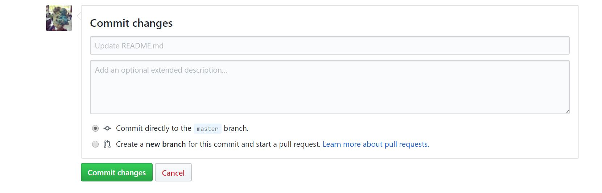

```{r setup, include=FALSE}
knitr::opts_chunk$set(echo = TRUE)
```

# Basic Guide on GitHub
The purpose of this tutorial is to get you familiar with the basics of GitHub in order to create and update your map
portfolio. Let's get started!


## Signing up for an account
1. The first thing that you need to do if you haven't already done it is to sign up for a GitHub account. Go   
   [here](https://github.com/) in order to create a Github account. If you need more detailed information to walk you 
   through creating an account, please follow steps 1 to three of [Signing up for a new GitHub account](https://help.github.com/articles/signing-up-for-a-new-github-account/).


## Creating a repository
1. After making your account, you will need to make a repository for your portfolio. Think of your repository as a 
   container in which you will hold your project. Click on the plus sign on the top right-hand corner and click on "new 
   repository." 
   
2. Name the repository "map_portfolio" and make sure to make the repository public.Also check "Initalize this repository 
   with a README" which will create a copy of the repository on your computer. By doing this, you are able to track your
   changes in GitHub. 
   
   
## Updating your README file
1. On your repository page, click on "README.md."

2. Click on the pencil icon on the middle right corner of the page in order to edit the README document. 

3. Change "map_portfolio" to "Map Portfolio". Notice that the "#" indicates a header. "##" will create a smaller header
   than "#" and "###" will create an even smaller header than "##". Make sure to put a space between the "#" and the word.
   You will know you did it properly when you see the text bolded out.

4. Write a description about your map portfolio if you have not already done so. 

5. Type "## Table of Contents" in order to create a table of contents section on your document.

6. List the Title of your map along with the accompanying file name. 

7. Once you are finished, scroll down and in the "Commit Changes" section, write a comment about what you did. For example "updated table of contents." It is always good to make comments so you can keep up with what you did. 

8. Press "Commit Changes" once you are finished writing your comments about what you did. 

9. Your README document should look something like this: 


## Uploading your map on GitHub
1. Click on "map_portfolio" on the top left-hand side of the page.

2. Click on "Upload files."

3. Either drag your file in the designated section on the repository or click "choose your files" in order to select your 
   map from a folder. Make sure that your file is either a JPG, GIF, PNG, or PDF file. 
   
4. Make sure to write a comment on what you did in the "Commit changes" section and press "Commit changes."

## Deleting your map on GitHub
1. Click on the trash can icon on the top right-hand corner.

2. You will be re-directed to the "Commit changes" page.  Make sure that you write a comment that you deleted the map.

3. Press "Commit changes". 


